# Clone Tiki Application

## Image App

<div style="display:flex, margin: 20px, flex: wrap">
     
     
     
     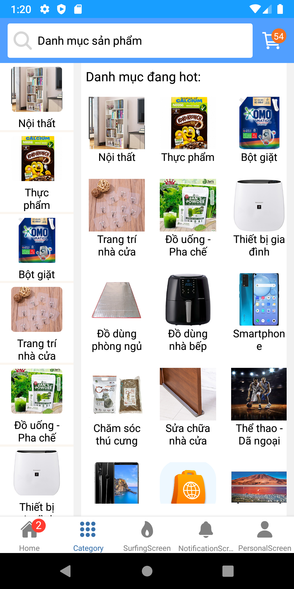
     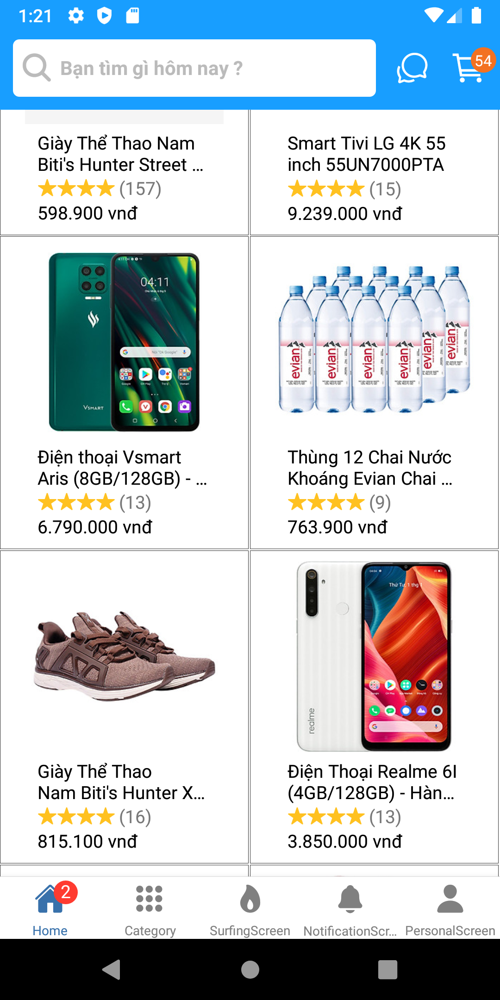
     
     
     
     
     
     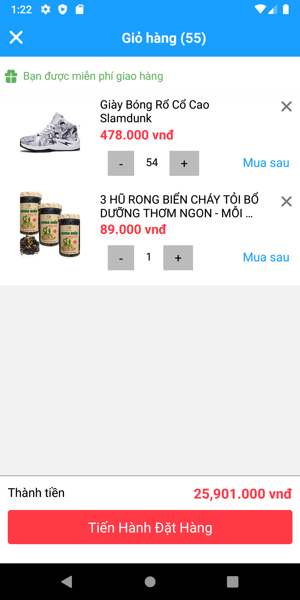
     
     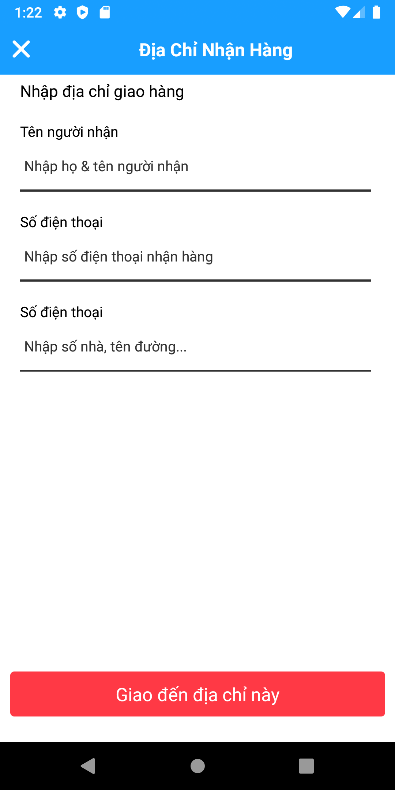
     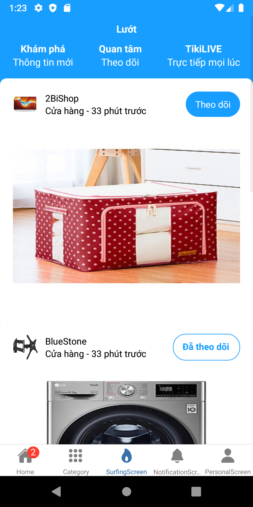
     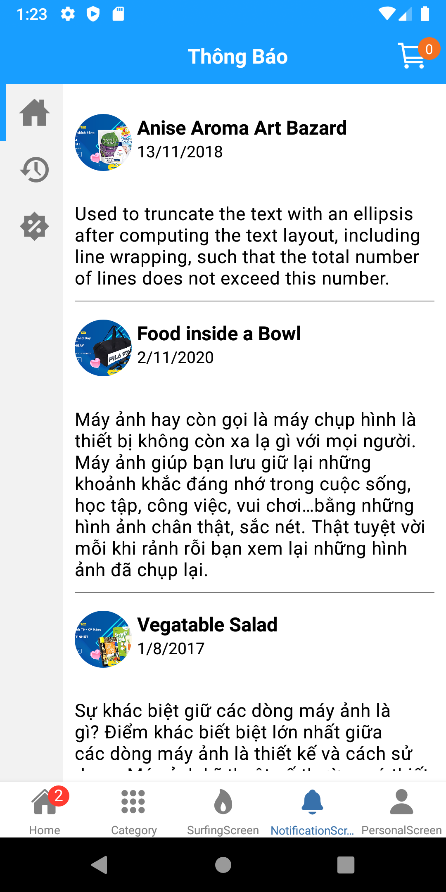
     
     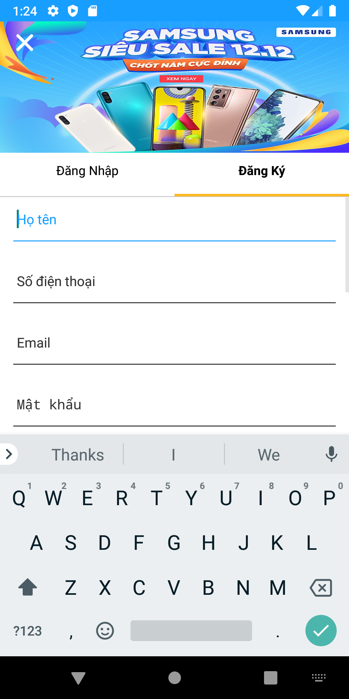
     
     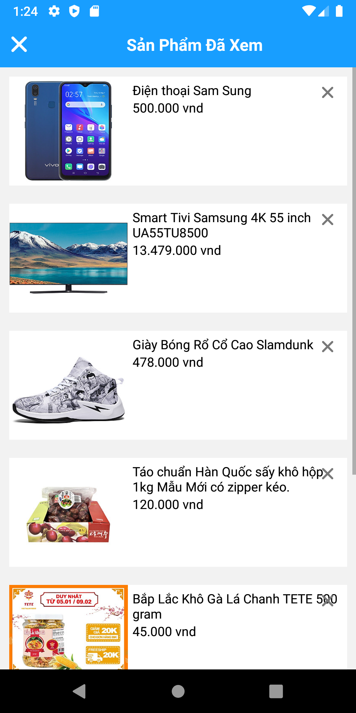
     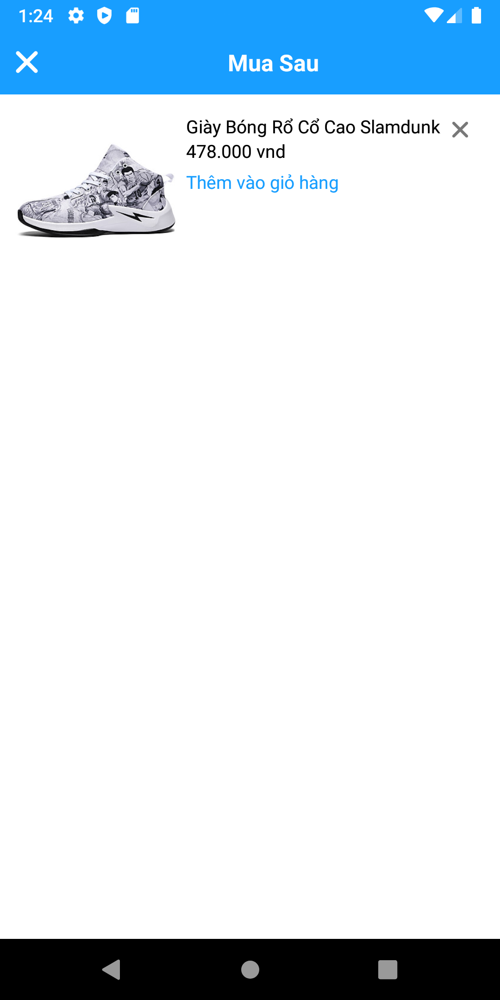
     
     
     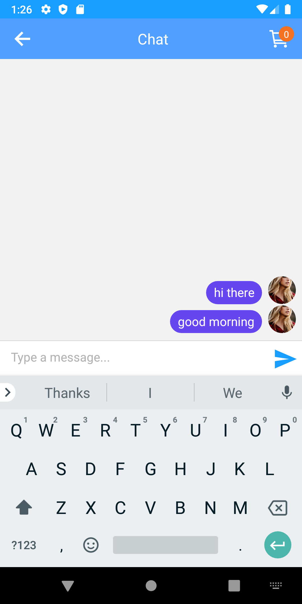
     
     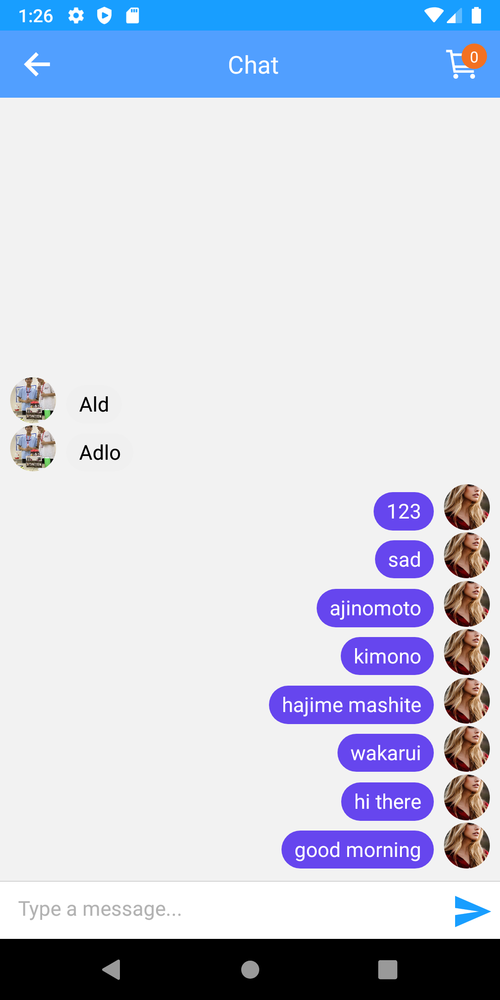
     
</div>
<div style="display:flex, margin: 20px, flex: wrap">
     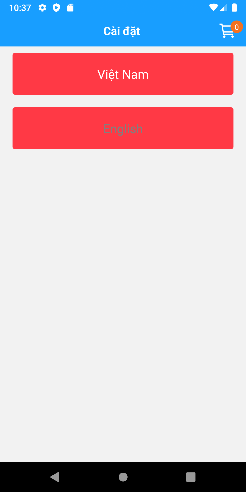  
     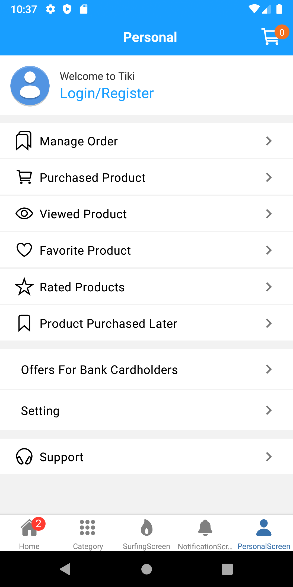  
       
     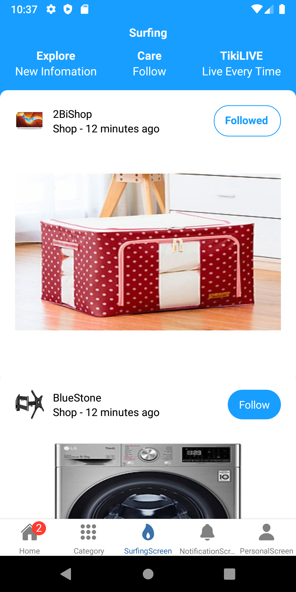  
     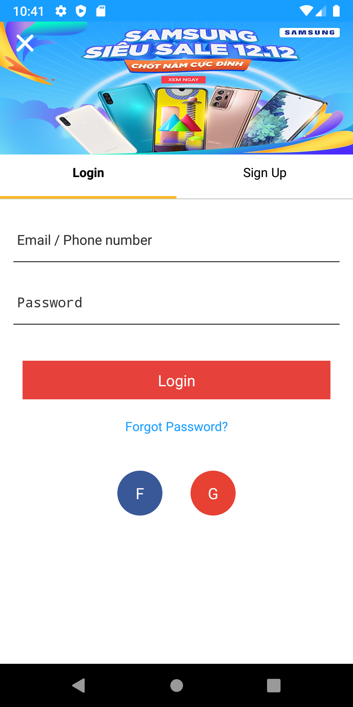  
</div>
## Structure Project

- assets
- components
- constants
- data
- i18n
- screens
- navigation
- Redux

## Run App

### Clone Repo:

`git clone https://github.com/duongnq2798/ecommerce_tiki_clone.git`

### Install Dependencies:

`npm install`

### Start App

`npm run android`

---

### Build Realease App

` cd android`
./gradlew assembleRelease
keytool -list -v -keystore ~/.android/debug.keystore -alias androiddebugkey -storepass android -keypass android

- Endcode Base64 ->>> uri

```
const encodedData = 'R0lGODlhAQABAIAAAAAA...7';
<Image source={{uri: `data:image/gif;base64,${encodedData}`}} />

```

## Pakage Uses

- [React Native](https://reactnative.dev/): `0.63.3`
- [React Native Paralax Scroll View](https://github.com/i6mi6/react-native-parallax-scroll-view): `1.1.4`
- [React Navigation](https://reactnavigation.org/)
- [React Native Firebase](https://rnfirebase.io/)
- [Redux](https://redux.js.org/)
- [React Native Firebase](https://redux.js.org/)
- [Redux Persist](https://redux.js.org/)

---

## luxon datetime: format time

[react-native-app-intro-slider](https://github.com/Jacse/react-native-app-intro-slider)

# Notes
